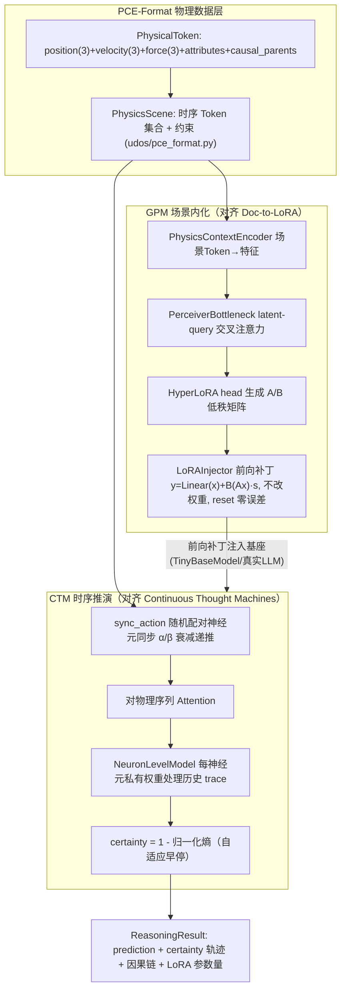
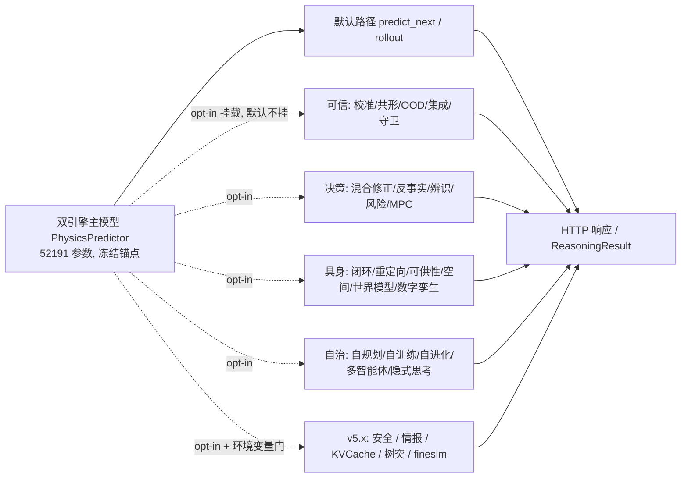
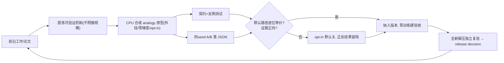
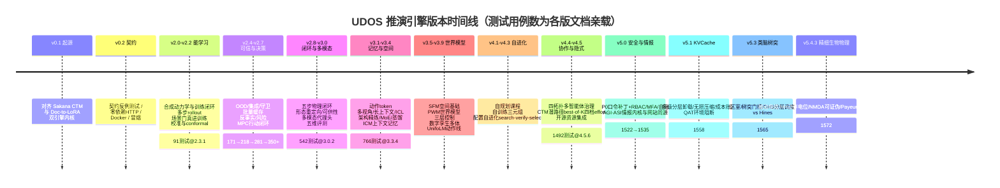

# UDOS 推演引擎 v5.4.3 内部结构、开发思路与全版本更新记录

> 包名：`udos-reasoning-engine`（`pyproject.toml` version = `5.4.3`）
> 定位：UDOS 物理世界数字化基础设施的**认知架构推演内核**——双引擎（CTM 连续思维机 + GPM 场景内化）+ 一条从 v0.1 持续累积到 v5.4.3 的"外挂、零梯度、opt-in、可证伪"能力栈。
> 本文所有结构、数字均在**全新解压目录**中实扫源码 / 文档 / checkpoint 并独立复算得到；凡未在本环境证实的微观数字一律标 `[UNVERIFIED]`，未启动的能力明确标注，不以规划冒充现状。

---

## 0. 怎么读这份文档

| 章节 | 回答的问题 |
|---|---|
| 一、一页速览 | v5.4.3 是什么、多大、锚点是什么、当前验证到什么程度 |
| 二、总体架构与数据流 | 双引擎本体、PCE-Format、能力栈如何外挂、HTTP 如何门控 |
| 三、目录与模块全景 | 128 个源文件按功能线归位，每个子系统负责什么 |
| 四、v5.x 四个新子系统详解 | 安全 / 情报(AGI·ASI) / KV Cache / 树突 / 精细生物物理 |
| 五、服务、部署与运行面 | server、开关、Docker、Makefile、控制台、脚本 |
| 六、测试与证据体系 | 1572 用例、覆盖率、A/B 账本、零训练硬验收怎么落地 |
| 七、开发思路（方法论） | 为什么所有新能力都"外挂、opt-in、analogy" |
| 八、全版本更新记录 | v0.1.0 → v5.4.3 完整时间线（含测试数演进） |
| 九、v5.4.3 finesim 逐模块与独立复验 | 6 个文件、复算数值、可证伪点 |
| 十、边界、未启动项与 `[UNVERIFIED]` | 哪些是真的、哪些只是引用、哪些等预算 |
| 十一、关键数字速查与复现命令 | 一页对账 + 可直接复制的命令 |

---

## 一、一页速览

| 项 | 现状（v5.4.3，已独立核验） |
|---|---|
| 包 / 版本 | `udos-reasoning-engine` **5.4.3**；双引擎描述：CTM（SakanaAI continuous-thought-machines）+ GPM（SakanaAI doc-to-lora） |
| 核心模型 | `PhysicsPredictor`：**52191 个可学习参数** + 48 个 buffer（`state_dict` 共 52239 张量元素）；`eval_mse = 0.045556` |
| 训练代际 | `checkpoints/` 内 **33 个正式 `.pt`**（文件名 v2.1.0 → v4.3.9；CHANGELOG 称 v4.3.9 为第 33 代）；**v4.4 起与整个 v5.x 全部外挂零训练，不再新增 checkpoint** |
| 源码规模 | `udos/` **128 个 `.py` / 24360 行**；其中顶层 84 个模块 + 6 个子包 |
| 测试规模 | `tests/` **204 个测试文件 / 22419 行；收集 1572 个用例，全新环境实跑退出码 0、0 failed / 0 error**；覆盖率 **93%（12537 stmts / 874 miss）** |
| 文档 / 证据 | `docs/` **65 个 Markdown**（每版 VERIFICATION + VERSION_PLAN + 专题 RESEARCH）；`benchmarks/results/` **99 个 JSON** A/B 证据 |
| 工程面 | `scripts/` 95、`demos/` 9、`web/` 3（控制台）；`Dockerfile`（python:3.12-slim）、`docker-compose.yml`、`Makefile`（含逐代 `ckpt*` 目标） |
| 运行依赖 | **极轻**：`torch>=2.0`、`numpy>=1.24`、`pytest`、`huggingface_hub`（仅真实上游 CTM 适配器用）；**无 scipy、无 mujoco、无 NEURON** |
| HTTP 面 | 单文件 `udos/server.py`（标准库 http.server），去重约 **97 个路径字符串 / 90+ 端点** |
| opt-in 门 | `UDOS_AUTH` / `UDOS_DEBUG` / `UDOS_KVCACHE` / `UDOS_BRAIN` / `UDOS_FINESIM`，**默认全关**；关闭时对应端点返回 **503**，主预测循环逐位不变；`/intel/*` 状态端点**始终 200**（优雅回退） |
| v5.4.3 新增 | `udos/finesim/` 6 文件：被动电缆、Hodgkin–Huxley、NMDA 时序抑制（可证伪）、Payeur 四类树突计算、Hines 串行 vs DHS 层级并行数值一致、突触位置鲁棒性、NGRAD 外挂假设；**+7 测试（1565→1572）** |
| 最高纪律 | 全部前沿能力为 **`analogy, not reproduction`**：CPU 合成机制类比，不进主 `state_dict`、不改默认输出；无 GPU/QAT/NEURON/认证器时显式 `ENV_BLOCKED`，不伪造结果 |

---

## 二、总体架构与数据流

### 2.1 双引擎本体（v0.1 奠定，此后不变）



要点（来自 `docs/ARCHITECTURE.md`，并与源码对应）：

- **PCE-Format** 是"物理 Token"标准：不是纯视觉 Token，而是带力 / 位姿 / 速度 / 因果父节点的结构化记录；`PhysicsSceneEncoder` 把任意属性维编码到 `d_model`。
- **GPM** 用 Perceiver 瓶颈把场景压成 LoRA 槽位，以前向补丁方式"临时内化"场景，`reset()` 还原原始 `forward`，因此**无浮点回滚误差、可瞬时切场景、与 PEFT/LoRA 前向数学一致**。
- **CTM** 在内部时间轴上跑多个 tick：同步 → 注意力 → 每神经元私有历史模型 → 预测；同步递推对齐上游 `compute_synchronisation`：`alpha←r·alpha+a_i·a_j; beta←r·beta+1; sync=alpha/sqrt(beta); r=exp(-decay)`。
- 双引擎之外的一切（v2.3 至 v5.4.3 的所有能力）都是**推理侧外挂**。

### 2.2 能力栈的挂载纪律（贯穿所有版本）



三条不可破坏的不变量（每个 VERIFICATION 都重复硬验收）：

1. **主参恒 52191、`eval_mse` 恒 0.045556**；
2. **不挂外挂时，输出与旧版本逐位一致**（none / 默认路径逐位等价）；
3. **33 代 checkpoint 逐件可加载且主参一致**（向后兼容）。

### 2.3 HTTP 门控与优雅回退

- 重能力端点用环境变量门控，关闭即 **503**，且不影响主循环：`UDOS_KVCACHE`、`UDOS_BRAIN`、`UDOS_FINESIM`（`server.py` 内 `os.environ.get(..., "off") in ("on","1")`，off 时 `raise RuntimeError` → 503）；认证走 `UDOS_AUTH`，调试面板走 `UDOS_DEBUG`。
- **状态/情报端点始终 200**，在硬件不可用时回退为 `gpu=false / *_simulator=ENV_BLOCKED / disclaimer`，而不是报错：`/intel/health`、`/intel/coefficient`、`/intel/capability`、`/intel/routes`、`/intel/predictions`、`/intel/models`、`/intel/asi`、`/intel/brain`、`/intel/finesim`、`/intel/infrastructure`。

---

## 三、目录与模块全景

### 3.1 顶层布局

```
udos-engine/
├── udos/                    # 128 py / 24360 行；84 个顶层模块 + 6 子包
│   ├── ctm_engine.py        # CTM 连续思维机（对齐上游）
│   ├── gpm_engine.py        # GPM 场景内化 / HyperLoRA / 注入器
│   ├── pce_format.py        # PhysicalToken / PhysicsScene / DemonstrationPrompt
│   ├── dynamics.py training.py persistence.py evaluation.py   # 合成动力学/训练/存取/评估
│   ├── policy.py reasoning.py server.py ...                    # 决策/推演/HTTP
│   ├── adapters/            # 2：sakana_ctm_adapter(真实上游交叉验证) 等
│   ├── connectors/          # 5 顶层 + actions/datasets/models：开源资源 L0/L1/L2 集成
│   ├── intelligence/        # 11：v5.0.2 AGI/ASI 情报内核（与网站同源）
│   ├── kvcache/             # 11：v5.1 KV Cache 分层卸载机制原型
│   ├── dendrite/            # 6：v5.3 类脑树突区室 / DHS
│   └── finesim/             # 6：v5.4.3 精细生物物理数值内核
├── tests/                   # 204 文件 / 22419 行 / 1572 用例
├── docs/                    # 65 md（VERIFICATION / VERSION_PLAN / RESEARCH / ARCHITECTURE / SECURITY）
├── benchmarks/results/      # 99 个 A/B 证据 JSON
├── checkpoints/             # 33 个正式 .pt（v2.1.0 → v4.3.9）
├── scripts/ (95)  demos/ (9)  web/ (3 控制台)
├── Dockerfile (python:3.12-slim)  docker-compose.yml  Makefile
└── pyproject.toml  requirements.txt  README.md  CHANGELOG.md
```

### 3.2 顶层 84 模块按功能线归位

| 功能线（版本） | 代表模块 | 职责 |
|---|---|---|
| 双引擎 / 数据底座（v0.1–v2.x） | `ctm_engine` `gpm_engine` `pce_format` `dynamics` `training` `persistence` `policy` `reasoning` | 物理 Token、双引擎前向、训练闭环、checkpoint 存取、推演与决策基座 |
| 可信推演（v2.3–v2.4） | `calibration` `ood` `ensemble` `guard` `robustness` | PAVA 保序校准、split-conformal 区间、OOD/漂移（马氏距离+KS）、深度集成、NaN/inf 守卫、噪声鲁棒 |
| 效率与服务（v2.5） | `batch` `cache` `logging_config` `server` | 批量推理、LRU 推理缓存、Prometheus 指标、无状态快照、回滚、统一日志 |
| 因果 / 反事实 / 决策（v2.6–v2.7） | `hybrid` `counterfactual` `identification` `adaptive` `decision` `online` `active_learning` `lite` `hierarchical` `experiment` | learned-residual 混合修正、干预式反事实、场景辨识/Sobol、自适应早退、风险分级、MPC 优选、在线适配、主动学习、剪枝/量化/蒸馏、实验治理 |
| 物理闭环 / 具身（v2.8–v3.9） | `physical_loop` `multitask` `retargeting` `affordance` `scene_graph` `occupancy` `spatial_query` `collision` `spatial` `future_multimodal` `eval_suite` `action_piece` `ego_data` `extended_context` `temporal_memory` `incontext` `longhorizon` `icm` `icm_events` `icm_cross` `icm_budget` `world_model` `wm_events` `wm_conservation` `wm_scheduler` `neural_control` `digital_twin` `multi_agent` `closed_loop` `wla` `embodied` | 五步闭环、多任务头、形态重定向、可供性、SFM 空间基础、多模态代理头、五维评测、动作 token、多视角/长上下文/记忆/ICL、ICM 上下文记忆、PWM 世界模型、大脑-小脑-脊髓三层控制、数字孪生/多体、UnifoLM 动作线 |
| 自治 / 协作 / 隐式（v4.x） | `selfplan` `curriculum` `selfsup` `self_train` `self_evolution` `collab_agents` `collab_governance` `collab_handoff` `collab_orchestrator` `collab_swarm` `collab_topology` `transfer_bundle` `latent_reasoner` `reasoning_router` `latent_collab` `resource_registry` `moe` | 自规划课程、自训练、配置自进化、四拓扑多智能体、Bundle 交接、治理三件套、CTM 潜路径 best-of-K、四档 effort、开源资源注册表 |
| 安全（v5.0.1） | `auth` `authz` `webauthn_mfa` `netops` `backup` `autonomy` `debug` | PBKDF2/RBAC/会话吊销、MFA（ENV_BLOCKED）、白名单联网、加密备份、受控自治 kill-switch、调试面板 |
| 情报（v5.0.2，子包） | `intelligence/*` | AGI 系数 / 奇点门 / 能力 / S 曲线 ETA / Brier / ASI-RSI / 模型聚合 / 风险信号 |
| 基础设施类比（v5.1，子包） | `kvcache/*` | 多级缓存 / 分页 / 压缩 / 成本账本 / fuse / cascade / infinity |
| 类脑（v5.3 / v5.4.3，子包） | `dendrite/*` `finesim/*` | 树突区室与 DHS；精细生物物理数值参考核 |

> 说明：`CHANGELOG.md` 连续记录 v0.1.0–v5.0.1（Keep a Changelog 格式）；**v5.0.2 起的变更以各版 `docs/VERIFICATION_v*.md` 与专题文档为权威载体**（CHANGELOG 未再追加 5.x 条目，这是仓库现状，不是遗漏）。

---

## 四、v5.x 四个新子系统详解

### 4.1 v5.0.1 安全与受控自治（含一次 P0 补丁）

- **P0 修复**：`udos/debug.py` 曾硬编码调试面板解锁口令并在 README/demos/QA 复述；修复为删除口令常量，`DebugPanel(level, enabled=None)`，缺省读 `UDOS_DEBUG`（默认关），输出走 stderr；新增安全守卫测试钉死"无硬编码口令/秘密字面量"，全树 grep = 0。
- 能力：`auth.py`（PBKDF2 哈希、签名会话+吊销、指数退避锁定、append-only 审计）、`authz.py`（RBAC，`UDOS_AUTH=on/off`，401/403，off 透明）、`webauthn_mfa.py`（契约完成，**ENV_BLOCKED**，无 fido2 不伪造）、`netops.py`（白名单外网）、`backup.py`（PBKDF2+流加密+HMAC，篡改拒绝）、`autonomy.py`（默认关、评估门、kill switch、不自动换权重）。
- 测试：`test_security_v501.py` 20 + `test_security_guard_v501.py` 3 + `test_debug_panel_v501.py` 7。

### 4.2 v5.0.2 情报分析服务内核 `udos/intelligence/`（11 文件）

- 模块：`coefficient`（EWMA，`FORMULA_VERSION="v1.0"`，α=0.3）、`singularity_gate`（奇点门四条件）、`capability`、`s_curve_eta`（logistic 三时界）、`prediction_scoring`（Brier=(p−o)²）、`asi_rsi`（间隔 `20-(rsi/100)*18`）、`model_aggregate`、`risk_signals`、`seed`、`api`、`__init__`。
- 端点：`/intel/health`、`/intel/coefficient`(+`/step`)、`/intel/capability`、`/intel/routes`、`/intel/predictions`(+`/score`)、`/intel/models`、`/intel/asi`。
- **与网站双终点同源**：公式 Read 自 `agi-asi-countdown/backend/app/core`（只 Read 不改），同输入同口径结果一致，由契约测试钉死；这是引擎与 AGI/ASI 倒计时网站的对接面。
- 反例契约：奇点门单源/未确认不触发、EWMA 有界、三时界 earliest≤median≤latest、Brier∈[0,1]、能力缺测保守、ASI 间隔随 RSI 增大而减、领袖乐观偏差折减。测试 `test_intel_v502.py` 14。

### 4.3 v5.1 KV Cache 分层卸载 `udos/kvcache/`（11 文件）

| 文件 | 职责 |
|---|---|
| `device.py` | GPU/CPU 设备抽象（仅 CPU 验证；GPU/QAT 路径 ENV_BLOCKED） |
| `block_store.py` | 多级后端 HBM→DDR→SSD→remote |
| `paged_cache.py` | PagedAttention 块表 + 前缀共享 |
| `policy.py` | LRU / LFU / TTL 冷热升降（LRU 不驱逐 pinned） |
| `compression.py` | zlib/zstd **无损** roundtrip；QAT 仅契约，无硬件 ENV_BLOCKED |
| `cost_ledger.py` | retain-vs-recompute 盈亏账本 |
| `fuse.py` | 重叠段融合（只复用重叠部分） |
| `cascade.py` | lite 预筛 + 召回下限，缩小主模型输入 |
| `infinity.py` | 长任务滑窗 / 按需加载，降低 HBM 常驻 |
| `sim.py` | 固定 seed 合成 trace 基准 |

- 端点：`POST /kvcache/sim/run`、`GET /kvcache/state`、`POST /kvcache/cost`、`GET /kvcache/metrics`（text/plain Prometheus）、`GET /intel/infrastructure`（始终 200）；门控 `UDOS_KVCACHE`。
- A/B（`kvcache_ab.json`）：小窗口 8 vs 分层窗口 128，同 seed=7 / 3000 token，**命中率 +0.494、重算单位 −1481，verdict=ACCEPT**；压缩无损；成本手算例 `{tier:ddr,hit:0.2,recall:10,recompute:4} → retain, breakeven=0.4`。
- **事实核实**：Qwen3-8B 官方 config 复算每 token KV = 2×36 层×8 KV 头×128 维×2 B = **147456 B = 144 KiB（≈147 KB 十进制）**，复算成立；Intel KV Shrink/QAT、80% 命中 TTFT≈5×、QAT≈软件压缩 2× 等**全部标为厂商口径，非自测**。测试 `test_kvcache_v510.py` 22（覆盖 v5.1.0+v5.1.2）。

### 4.4 v5.3 类脑树突 `udos/dendrite/`（6 文件）

| 文件 | 内容（均标注 analogy） |
|---|---|
| `compartment.py` | `Compartment`（apical/basal/soma，distance，leak=0.3），被动衰减权重 `exp(-leak·distance)`；`CompartmentTree` 记录每区室电压历史 |
| `dendritic_compute.py` | `coincidence_detect`（±window 事件重合）、`nmda_amplify`（超阈 S 型放大）、`temporal_inhibition`（抑制相对兴奋 Δt 决定门控，exp 衰减）、`inhibition_curve`（Δt 扫描） |
| `multimodal_sync.py` | `align_channels`：多通道时间戳去均值对齐 + jitter 报告；"微秒级"属生物/硬件口径，引擎只做相对对齐 |
| `dhs_scheduler.py` | `_depth/layer_schedule`（按依赖深度分层、深→浅，同层并行）、`serial_order`（Hines 式拓扑串行）、`run_voltages`（base+依赖电压均值，确定性）、`benchmark`（关键路径步数=层数、speedup_steps、worker_count 由调用方传入不硬编码） |
| `brain.py` | `brain_sim`（seed=7 合成 trace）、`brain_dhs`、`brain_robustness`（树突滤波前端 vs 线性前端 keep 率，合成假设值）、`brain_status`（读 `torch.cuda.is_available`，`NEURAL_SIMULATOR="ENV_BLOCKED"`） |

- 端点：`POST /brain/sim/run`、`/brain/dhs/benchmark`、`/brain/robustness/run`（`UDOS_BRAIN`）；`GET /intel/brain` 始终 200。
- CPU 自测：默认 5 节点树 serial_steps=5 / dhs_layers=4 / 电压一致 / speedup≈1.25；**"O(N³)→O(2N)"、"最多 16 线程"、GPU 100–1000×、8 GPU 5 万神经元均未在本机读 PMC 原文逐条证实 → `[UNVERIFIED]`**（DeepDendrite 口径，非自测）。测试 `test_brain_v530.py` 7。

### 4.5 v5.4.3 精细生物物理数值内核 `udos/finesim/`（6 文件）

见**第九章逐模块详解与独立复验**。开关 `UDOS_FINESIM`，端点 `POST /finesim/{cable,hh,hines_dhs,nmda_inhibition,payeur,robustness}`，`GET /intel/finesim` 始终 200。定位是**纯 CPU、numpy/标准库参考/类比核，不运行 NEURON**。

---

## 五、服务、部署与运行面

| 面 | 现状 |
|---|---|
| HTTP 服务 | `udos/server.py` 单文件、Python 标准库 `http.server`（无 Web 框架）；约 90+ 端点；含线程安全 `MetricsCollector`（计数 / p50 / p95 / p99 / 缓存命中 / OOD 率，Prometheus 文本） |
| 错误语义约定 | 非法输入 **400**、未训练 **409**、opt-in 未启用 **503**、未认证 401 / 越权 403、未知 id 404；资源 L3/缺失 503 |
| 容器 | `Dockerfile` = `python:3.12-slim`；`docker-compose.yml`；`.dockerignore` |
| 构建 | `Makefile`：`install/test/cov/perf-ab/bench/guard/train`，以及逐代训练件目标 `ckpt22 … ckpt390`、`eval5d`、各类 `*-ab` |
| 控制台 | `web/udos_console.html` 等 3 个文件：数据看板（安全面板见 SECURITY.md） |
| 演示 / 脚本 | `demos/` 9、`scripts/` 95（A/B、特征延迟、课程、伪标签、自训练、自进化等可复跑脚本，结果落 `benchmarks/results/`） |
| 真实上游对接 | `udos/adapters/sakana_ctm_adapter.py` 可经 `huggingface_hub` 直接加载真实 CTM 上游代码做交叉验证；机制对齐版不需要该重依赖 |
| 典型启动 | `UDOS_AUTH=off python -m udos.server --port 8000 --preset small`；重能力再加 `UDOS_KVCACHE=on / UDOS_BRAIN=on / UDOS_FINESIM=on` |

---

## 六、测试与证据体系

### 6.1 测试规模（本环境全新解压实跑）

- 收集用例 **1572**；`python3 -m pytest -q` 全量执行**退出码 0、0 failed / 0 error**（进度 100% 全点号）。
- 测试文件 **204** / 22419 行；覆盖率 **93%（12537 stmts / 874 miss）**。
- v5.x 测试文件与用例（实扫）：

| 文件 | 用例 | 归属 |
|---|---|---|
| `test_security_v501.py` | 20 | v5.0.1 认证/RBAC/备份/自治 |
| `test_security_guard_v501.py` | 3 | v5.0.1 无硬编码秘密守卫（含变异敏感） |
| `test_debug_panel_v501.py` | 7 | v5.0.1 调试面板显式 enabled |
| `test_intel_v502.py` | 14 | v5.0.2 情报内核/与网站同口径 |
| `test_kvcache_v510.py` | 22 | v5.1.0 + v5.1.2 KV Cache |
| `test_brain_v530.py` | 7 | v5.3 树突/DHS |
| `test_finesim_v543.py` | 7 | v5.4.3 精细核 |

### 6.2 证据如何组织（不是"跑绿就行"）

1. **契约 → 反例 → 证据**：每个新能力先钉最高风险契约并配可使其变红的反例（如 LRU 不得驱逐 pinned、奇点门单源不触发、QAT 无硬件必须 503、fuse 只复用重叠段、cascade 召回下限）。
2. **A/B 账本落 JSON**：`benchmarks/results/` 99 份，记录同 seed / 同合同的 baseline vs candidate 与 verdict（ACCEPT/REJECT）；**正反结果都留档**——例如数据增强 in-distribution 无一致收益（仅利 OOD）→ 默认关；隐式思考不改善物理 MSE、不省延迟 → 价值仅在可观测/可追溯；自进化多代曲线如实区分 improving / drifting / collapsed。
3. **零训练硬验收（每版重复）**：主参 52191、`eval_mse` 0.045556、33 代 checkpoint 逐件可加载主参一致、"四锚点"逐位不变、全树 grep 历史口令/姓名 = 0。
4. **边缘加固惯例**：每个线终点有 `test_v261_edge / test_v272_edge / test_v283_edge …`，专打空 batch、非有限值、horizon=0/1、NaN 降级、400/409/503 矩阵。
5. **独立复验发布**：每版 `docs/VERIFICATION_v*.md` 顶部写 `release decision: go/no-go`，并要求"全新解压到 /tmp 独立复跑通过"才打包。

---

## 七、开发思路（方法论）

整套引擎最值得复用的不是某个模块，而是它在"用 5 万参数小模型对标前沿巨系统"时坚持的工程纪律：

1. **analogy, not reproduction（机制类比，不复刻）**。受 Transformer 之外的前沿工作（CTM、Doc-to-LoRA、PCE、世界模型、RSI、多智能体、隐式思考、KV Cache 分层、树突计算、精细神经元、NMDA 时序抑制）启发时，只在 CPU 上实现其**可验证的机制骨架**，用合成/低维代理替代真实数据与权重，并在每个文件 docstring 显式标注 `analogy`，不声称复现论文效应量。
2. **外挂、零梯度、opt-in、默认逐位等价**。新能力优先做成推理侧后处理 / 前向补丁 / 编排器，**不进主 `state_dict`、默认不挂载**；none / 默认路径与旧版逐位一致。这条纪律让 52191 参数与 0.045556 的 MSE 在几十个版本里始终不变，从而把"新功能会不会悄悄改坏主模型"这个最大风险降到零。
3. **场景内化用前向补丁而非改权重**。沿用 Doc-to-LoRA 的 `partial` 替换 + `reset()`：无浮点回滚、可瞬时切场景、数学与 PEFT/LoRA 一致。
4. **证据先于主张（A/B 裁决）**。任何"更好/更快/更稳"的说法必须有同 seed、同合同的 baseline/candidate JSON；得不到正向证据就如实记录并把特性关在默认值外（opt-in 默认关），不用措辞掩盖。
5. **可证伪优先**。关键机制配一个"如果理论成立应当出现、不成立应当消失"的对照——最典型是 NMDA 镁阻滞：有镁时输出随时序差 Δt 敏感（range>0），移除镁阻滞立刻不敏感（range=0）；以及 Hines 串行与 DHS 并行必须数值一致（<1e-9）。
6. **ENV_BLOCKED 诚实原则**。没有 GPU / QAT / NEURON / CoreNEURON / fido2 认证器 / 在线 LLM 时，明确返回环境阻断与免责声明，**绝不伪造加速、伪造 MFA 成功或伪造生物仿真结果**；厂商口径数字与自测数字严格分栏。
7. **文献微观数字 `[UNVERIFIED]`**。"16 线程 / 10× / 100–1000× / 5 万神经元 / O(N³)→O(2N)"等未逐条读到原文条件的数字，只引用、不写入自测结论。
8. **安全默认关 + 最小权限 + kill switch**。认证、联网、备份、自治、调试全部默认关闭或显式启用；自治不自动替换生产权重；硬编码秘密零容忍（v5.0.1 为此发过 P0 补丁）。
9. **向后兼容是硬合同**。33 代 checkpoint 逐件可加载；旧档缺新键时诚实退化（如无 calibration 键则 `is_calibrated=False`、无 hybrid 则 None）。
10. **实现与验收分离**。每版由全新解压目录独立复跑、发 release decision；文档只签发可回链到源码 / 测试 / JSON 的结论。
11. **与产品端同源、可降级**。v5.0.2 情报内核的预测公式与网站 `core` 逐字对齐并由契约测试钉死；引擎不可达时网站回退本地快照，引擎侧 `/intel/*` 也始终 200——两侧都不为"完整性"牺牲可用性。



---

## 八、全版本更新记录（v0.1.0 → v5.4.3）

> 来源：仓库 `CHANGELOG.md`（v0.1–v5.0.1 连续）+ 各版 `docs/VERIFICATION_*.md` / `VERSION_PLAN_*.md` / 专题 RESEARCH（v5.0.2 起）+ 本地留存的 22 个发布 zip。
> 引擎版本号中**不存在 v1.x、v5.2.x**（v5.2 是网站线的架构评审，与引擎无关）；v0.x 仅有 CHANGELOG 文字、无留存 zip；每个"线"普遍按 `x.y.0 起点 → dev1…6 → x.y.1/2 集成加固 → x.y.3/9 线终点`推进。

### 8.1 版本时间线



### 8.2 v0.x – v2.x：从双引擎到可信决策

| 版本 | 主题 | 关键新增 / 结果 |
|---|---|---|
| **0.1.0** | 双引擎起源 | 对齐 Sakana AI CTM / Doc-to-LoRA 的双引擎机制内核与上游真实 CTM 适配 |
| **0.2.0** | 工程契约 | 契约/反例测试、性能基准与回归守卫、零依赖 HTTP 服务、Docker/compose/Makefile、冒烟；修复 GPM 场景编码器每次前向重建导致的不确定（改持久化子模块） |
| **2.0.0** | 能学习·真耦合 | `dynamics/training/persistence`：合成动力学 + 物理预测训练闭环 + checkpoint；CTM 场景条件化通路与 GPM `scene_embedding`（零门控、向后兼容）；`POST /train` |
| **2.1.0** | 多步推演 | 参数化数据集（历史 X / 未来 Y / 隐藏参数 P）；`rollout` 多步自由滚动；场景参数经 `scene_encoder` **真正进入训练回路**；统一 `evaluation`；修复运动学一致性误用（改用前一帧速度、降级为诊断） |
| **2.2.0 / 2.2.1** | 鲁棒与治理 | Scheduled Sampling（opt-in，A/B 随种子变化故不设默认）、早停、`set_seed` 确定性入口、rollout 累积率/置信分层；`/evaluate`、`/save`（未训练 409） |
| **2.3.0 / 2.3.1** | 置信校准 | 保序回归 PAVA（独立集 ECE 降约 4.5×）、split-conformal 预测区间（90% 名义≈90% 覆盖）、多时域损失（不稳健故默认 front）；`/calibrate`、`/checkpoints`、`/load`；**91 测试** |
| **2.4.0–2.4.16** | 可信推演 | OOD/漂移（岭正则马氏距离+KS）、流式漂移、深度集成、退化守卫、温度缩放、噪声鲁棒、多水平 conformal（80/90/95）、逐步逐维置信；**171 测试 / 覆盖率 93%** |
| **2.5.0–2.5.2** | 效率与服务 | 批量推理（与逐笔 max diff 1.97e-06）、LRU 推理缓存、`GET /metrics`、无状态快照（不含权重）、`/rollback`；**218 测试**；诚实记录小模型批量/缓存收益场景有限 |
| **2.6.0–2.6.2** | 因果/决策 | learned-residual 混合修正（残差降约 93.6%）、干预式反事实、场景辨识/Sobol、自适应早退、风险三档、快照差分；`/counterfactual`/`/identify`/`/risk`/`/diff-checkpoints`；v2.6.1 六项边缘加固；**281 测试**，ECE 0.0565、coverage 0.8888 |
| **2.7.0–2.7.3** | 预测→行动 | MPC 动作优选、在线漂移再校准（默认只跑 PAVA 不改权重）、主动学习（0.264 vs 随机 0.502）、剪枝/INT8/蒸馏、分层 rollout、多种子实验治理；`/policy/select` 等四端点；**350+ 测试** |
| **2.8.0–2.8.3** | 物理闭环 | `PhysicalLoopRunner` 五步闭环（observe→understand→predict_action→future_state→feedback，默认逐位等价）、共享 backbone 多任务头（encode 一次 **2.34× 延迟优势**）；`/loop/step`、`/multitask/predict` |
| **2.9.0–2.9.3** | 形态/可供性 | 形态无关动作重定向（DOF 映射/重采样/限幅/零样本迁移）、可供性打分与规划、空间关系头；**analogy** 不碰真机/RGBD |

### 8.3 v3.x：多模态、记忆、空间、世界模型、数字孪生、动作线

| 版本 | 主题 | 关键新增 |
|---|---|---|
| **3.0.0–3.0.3** | 多模态 + 五维评测 | `future_multimodal`（共享 latent 的 RGB/深度/对象 mask 低维代理，A/B 不提升状态 MSE 故 opt-in）、`eval_suite` 五维内部基准（非 PhysBrain 榜单）；`/future/predict`、`/eval/5d`；**542 测试** |
| **3.1.0–3.1.3** | ActionPiece 动作 token | k-means/两级残差码本、n-gram 自回归 next-token、token→连续动作平滑（跳变 4×↓）、序列课程、in-context 动作提示；`/action/tokenize`、`/detokenize` |
| **3.2.0–3.2.3** | 多视角/长上下文/记忆 | Ego360 启发合成增强（A/B 仅利 OOD，默认关）、扩展窗口、环形时间记忆+EMA 摘要、ICL、长 horizon rollout；`/augment/generate`、`/icl/predict` |
| **3.3.0–3.3.4** | 架构精炼/效率/加固 | CTM 残差/LayerNorm/可配置初始化（默认关）、轻量 MoE、蒸馏 v2/结构化剪枝 v2、梯度检查点/FP16 缓存、鲁棒性评测；效率 Pareto 推荐 full；**v3.3.4 hardening：修 6 真缺陷、42 模块切标准库 logging、2 项性能 ACCEPT（−11%/−41%），766 测试** |
| **3.4.0–3.4.5** | ICM 上下文记忆 | 演示记忆余弦检索 + **残差空间聚合**（naive 拼接 0.09→4.19 vs ICM 0.045→0.014）、三流事件对齐、跨本体归一、预算压缩；零梯度；PCE HTTP 提示词包 |
| **3.5.0–3.5.3** | SFM 空间基础模型 | SceneGraph、OccupancyGrid + 有符号距离场、碰撞/最近邻、正交视图可逆、空间查询引擎；纯解析几何 numpy、零可学参数；`/spatial/query`、`/spatial/collision` |
| **3.6.0–3.6.3** | PWM 物理世界模型 | 多步想象 rollout、接触/碰撞预测、动量/能量守恒检验、世界模型不确定性与回退、长 horizon 想象 vs 真实对比；`/wm/imagine`、`/wm/conservation` |
| **3.7.0–3.7.3** | 三层神经控制 | 大脑慢规划（MPC）、小脑轨迹平滑（PID+前馈+低通）、脊髓反射弧（碰撞制动/越界截断/超速减速）、多频率分层调度、反射优先级；`/neural/step`、`/neural/reflex/log` |
| **3.8.0–3.8.7** | 全域调度/数字孪生 | 多体 WM 想象预算调度、规划-执行-反馈闭环、合成数字孪生场景、多体协同与冲突消解、`/twin/step`、`/twin/scene`；v3.8.6 最终训练重建 + 25 代兼容 |
| **3.9.0–3.9.9** | UnifoLM-WLA 动作类比线 | 相邻状态差分→稀疏 change-mask、VQ/RVQ 动作分词、动作-状态-任务对齐、冻结骨干外挂 flow-matching 解码、跨本体/跨末端迁移、统一头评测；终件第 27 代 |

### 8.4 v4.x：自规划、自训练、自进化、多智能体、隐式思考、开源资源

| 版本 | 主题 | 关键新增 / 结果 |
|---|---|---|
| **4.1.0–4.1.9** | 自规划自监督 | 任务/课程自动生成器 + 可解性自验证器、课程难度递进、自生成 vs 固定课程 A/B、PWM 一致性/物理守恒伪标签、目标分解、置信门控/收敛停止/OOD 验证；终件第 29 代 |
| **4.2.0–4.2.9** | 完全自训练 | 世界模型自产 (s,a,s') 三元组、自博弈+守恒校验、ensemble/calibration 评审、人工抽检 hook、**teacher→student 仅一代可验证闭环**、数据回流三档、退化检测与回滚、收益递减判据；终件第 31 代；防退化：不宣称 RSI 必然提升 |
| **4.3.0–4.3.9** | 完全自进化 | 系统配置自优化搜索器（旋钮：分片/缓存/集成权重/皮层频率/码本），**保真硬门（max_abs_diff≤atol）+ 成本轴**，网格枚举 search→verify→select，orchestrator 串联 4.1 课程→4.2 数据→4.3 配置，多代曲线诚实记 improving/drifting/collapsed，全局停止/回滚；终件**第 33 代 v4.3.9（最后一个训练件）** |
| **4.4.1** | 多智能体协作 | `transfer_bundle` 五要素交接、治理三件套（Owner/Trace/Stop/ClaimLock，无 owner/无 stop 拒启动）、能力注册/Agent-as-Tool、四拓扑 star/chain/mesh（mesh 默认关）+ 决策树选拓扑、TraceChain 强制收口唯一 owner；零可训参数 |
| **4.5.3** | 隐式思考 Latent Reasoning | CTM 连续隐藏状态 K 条潜路径 best-of-K（非 token 层 beam）、四档 effort（none K=1 σ=0 逐位等价 / low K=2 / high K=4 / max K=8）、难度自适应路由、三专家协作与分歧升级；`/reason/latent`、`/reason/route`；**Pareto A/B 诚实结论：不改善物理 MSE、不省延迟，价值在可观测/可追溯** |
| **4.5.4–4.5.6** | 开源资源集成 + 收口 | L0 注册表 / L1 格式适配 / L2 真 smoke（CPU-only）、全量 79 条可发现 + profile 运行时切换、bug 修复/性能/QA；**v4.5.6 基线 1492 测试** |

### 8.5 v5.x：安全、情报、基础设施类比、类脑（当前代）

| 版本 | 测试用例（增量） | 覆盖率 stmts/miss | 主题与关键结果 |
|---|---|---|---|
| **5.0.1** | 1522（v4.5.6 1492 **+30**） | 11581 / 814（93%） | **P0 硬编码口令补丁**；认证+RBAC、WebAuthn MFA（ENV_BLOCKED）、受控联网、加密备份、受控自治/kill switch、调试面板显式开关；全树 grep 秘密=0 |
| **5.0.2** | 1535（**+13**） | 11819 / 749（94%） | `intelligence/` 情报内核（8 机制模块 + seed + api）；9 锁定端点；**EWMA/奇点门/Brier/RSI/logistic 公式与网站 core 同源**，契约测试钉死 |
| **5.1.0** | 1550+ | 12128 / 857（93%） | `kvcache/` 10 模块分层卸载；A/B 命中率 +0.494 / 重算 −1481 ACCEPT；Qwen3-8B 144 KiB/token 复算；QAT ENV_BLOCKED；sim 输入 400 矩阵 |
| **5.1.2** | 1558（5.1.1 1552 **+6**） | 12211 / 868（93%） | fuse/cascade/infinity 固定 seed 可复算；`/kvcache/cost`（breakeven=0.4）、`/kvcache/metrics`（Prometheus）、`/intel/infrastructure` |
| **5.3.0** | 1565（**+7**） | 12388 / 873（93%） | `dendrite/` 树突区室/树突门控/多模态对齐/DHS 分层调度；CPU serial=5/layers=4/speedup≈1.25；16 线程/10×/100–1000×/5 万神经元 `[UNVERIFIED]` |
| **5.4.3** | **1572（+7）** | **12537 / 874（93%）** | `finesim/` 精细生物物理数值核：被动电缆、HH 动作电位与 f-I、NMDA 时序抑制可证伪对照、Payeur 四类、Hines-DHS 数值一致、突触位置鲁棒、NGRAD 外挂假设；本环境独立复算全部命中（见第九章） |

> 测试用例数随版本单调不减（"只增不删"是硬规则）；覆盖率口径随新模块加入小幅波动但稳定在 93–94%。

---

## 九、v5.4.3 finesim 逐模块与独立复验

> 下列数值由我在全新解压目录用纯标准库/numpy **独立复算**（非转抄文档），与 `docs/VERIFICATION_v5.4.3.md` 记录逐项吻合。

### 9.1 `cable.py` — 被动电缆（Rall 1959）

- `cable_params(d,R_m,R_a,C_m)`：衰减长度 `λ=√(d·R_m/(4R_a))`、时间常数 `τ=R_m·C_m/1000`（ms）；`passive_decay = exp(-x/λ)`；`verify_lambda` 让离散数值与解析解对照。
- 复算默认参数：**λ = 5.0 mm、τ = 10.0 ms、拟合最大误差 = 0.0**（数值即解析基线）。

### 9.2 `hh.py` — Hodgkin–Huxley 动作电位（1952）

- 确定性 Euler 积分，**步长 dt = 0.05 ms**，初值 v=−65，标准常数 gNa=120 / gK=36 / gL=0.3、ENa=50 / EK=−77 / EL=−54.387；spike 判定为**过零检测**（`prev<0 且 v≥0`，v<−20 复位），并非固定 −55 mV 阈值。
- 复算：**I=10 µA → spikes=4、peak=42.72 mV、min=−75.19 mV**；f-I 曲线 **I=2→0 Hz、5→1 Hz、10→4 Hz、20→5 Hz**。

### 9.3 `nmda.py` — NMDA 镁阻滞与时序性抑制（可证伪）

- Jahr–Stevens 电导 `g=1/(1+(Mg/3.5)·exp(-v/16.1))`；`temporal_suppression` 让平台电压依赖兴奋/抑制的时间差 Δt；`falsifiable_control` 扫描 Δt∈{−2,0,3,6}。
- 复算（这是全模块最关键的**可证伪对照**）：
  - 有镁阻滞：g 随 Δt 变化，**range = 0.106956（时序敏感）**，序列 `[0.502632, 0.502632, 0.432977, 0.395676]`；
  - 移除镁阻滞：g 恒为 1，**range = 0（时序不敏感）**。
  - 即"镁阻滞是时序性抑制的关键"这一论断在代码里是**可以被跑反的**。依据 Du 2017 / Doron 2017。

### 9.4 `payeur.py` — 四类树突信息处理 / 位置鲁棒性 / NGRAD

- `payeur_demo(seed=7)`：时空滤波、信息选择（NMDA 集群阈值）、信息路由（抑制 A 路走 B 路）、信息多路复用（平台电位载波）；固定 seed 的**最小合成演示**，非复现。
- `synaptic_position_robustness(seed=7)`：50 次、±0.1 均匀扰动，**远端前馈 spread = 0.0563 < 近端胞体 spread = 0.1878**，方向与"远端被动衰减抗噪、更鲁棒"一致（缩比合成，不声称论文效应量）。
- `ngrad_hypothesis()`：NGRAD（树突平台电位承载误差回传）仅作**外挂假设**，`state="analogy hypothesis, not trained"`，不进 state_dict、不被序列化；引用 Beniaguev/Segev/London, Neuron 109(17):2727–2739, 2021（L5PC ≈ 5–8 层时序卷积 DNN，R²>0.95，可学 XOR）。

### 9.5 `hines_dhs.py` — Hines 串行 vs DHS 层级并行一致性

- 复用 `dendrite.dhs_scheduler`：默认 5 节点 DAG（n1→{n2,n3}→n4→n5）。
- 复算：**hines_serial_steps = 5、dhs_parallel_layers = 4、numerical_consistent = True（逐节点差 < 1e-9）**。
- 自带声明：本机 CPU 仅报步数/层数；"16 线程 / 10× / 100–1000× / 5 万神经元" **`[UNVERIFIED]`**（真实 GPU 加速属 DeepDendrite 口径）。

### 9.6 文献引用（DOI，区分引用与自测）

- Rall 1959 电缆理论；Hodgkin–Huxley 1952。
- Beniaguev/Segev/London, *Neuron* 109(17):2727–2739, 2021。
- DeepDendrite, *Nature Communications* 14, 2023（DOI `10.1038/s41467-023-41553-7`，PMC10507119）。
- Payeur 2019, *Curr Opin Neurobiol* 58:78；Du 2017（PubMed 28827326）；Doron 2017, *Cell Reports* 21 / ModelDB 152901；CTM, NeurIPS 2025, arXiv 2505.05522。

---

## 十、边界、未启动项与 `[UNVERIFIED]`

### 10.1 由代码形态直接可证的现状边界（finesim / dendrite）

- HH 为**单室、简化门控**教学级数值核；`finesim/cable.py` 是解析电缆 + 自对照，**不是真实多室形态的联立求解器**。
- DHS 在引擎里是 **DAG 调度的步数/层数类比**（确定性电压 = base + 依赖均值），用于证明"分层并行与串行数值一致、关键路径步数下降"，**不是 NEURON/CoreNEURON/DeepDendrite 的 GPU 数值核**。
- NGRAD 只有假设性数据结构，**无任何后向传播学习发生**（不训练、不入 state_dict）。
- 未接入真实形态库（如 NeuroMorpho）、未做离子通道级/H–H 电缆耦合的大规模仿真。

### 10.2 明确未启动 / 等预算的能力（不冒充已完成）

| 项 | 状态 | 阻塞 |
|---|---|---|
| **v5.3.1 MuJoCo 因果虚拟小鼠**（MIMIC/MJX、38 自由度、虚拟 rodent） | **未在引擎实现**：`requirements` 无 mujoco，`udos/` 无 rodent/mimic 模块；仅开源资源目录与研究文档提及 RoboMimic 等第三方条目 | 需新增 MuJoCo 依赖与 MB 级模型下载授权 |
| GPU + vLLM KV offload / QAT 压缩真实 TTFT、吞吐基准 | 未执行（`device.py` GPU/QAT 路径 ENV_BLOCKED） | 需 GPU / 云预算 |
| NEURON / CoreNEURON / DeepDendrite 对拍 DHS、真实生物数据 | 未执行（`NEURAL_SIMULATOR="ENV_BLOCKED"`） | 需 HPC / GPU |
| 在线多 LLM 交叉打分（情报内核） | 未接 provider，离线默认；仅内置确定性样例 | 需 OpenAI 兼容 LLM key |
| TLS 反代、生产部署（域名/备案） | 仓库给 Docker/compose/Makefile 与 SOP，未代用户实名办理 | 需云账号/域名/ICP |

### 10.3 `[UNVERIFIED]` 清单（引用但未自测）

"最多 16 线程"、"约 10× / GPU 100–1000×（上界 1000×，基线为 Hines/CPU）"、"O(N³)→O(2N)"、"8 GPU 模拟 5 万精细神经元"、Intel KV Shrink/Fuse/Cascade/Infinity 与 QAT 的 80% 命中 TTFT≈5× / QAT≈软件压缩 2× / 压缩省 20–30% 等——**均为论文或厂商特定条件口径，未在本环境逐条证实**，引擎自测只报本机 CPU 可复算的步数、层数、命中率与盈亏比。

---

## 十一、关键数字速查与复现命令

### 11.1 一页对账（全部本环境核验）

| 指标 | 值 | 取证方式 |
|---|---|---|
| 源码 / 测试 | 128 py·24360 行 / 204 测试文件·22419 行·**1572 用例全绿** | `find`/`wc` + `pytest` 退出码 0 |
| 覆盖率 | 93%（12537 stmts / 874 miss） | `docs/VERIFICATION_v5.4.3.md` |
| 主模型可学习参数 / buffer | **52191 / 48**（state_dict 张量元素 52239） | 加载 v4.3.9 ckpt 数 `parameters()`/`buffers()` |
| eval_mse | **0.045556** | `benchmarks/results/training_v4.3.9.json` |
| checkpoint | 33 件（v2.1.0→v4.3.9；v4.3.9 为第 33 代） | `ls checkpoints/*.pt` |
| HH I=10 | spikes=4 / peak 42.72 mV / min −75.19 mV；f-I 0/1/4/5 Hz | 直接 import 复算 |
| 电缆默认 | λ=5.0 mm、τ=10 ms、拟合误差 0 | 直接 import 复算 |
| NMDA 可证伪 | 有镁 range=0.106956 / 无镁 range=0 | 直接 import 复算 |
| Hines-DHS | serial=5、layers=4、一致（<1e-9） | 直接 import 复算 |
| 突触位置鲁棒 | 远端 spread 0.0563 < 近端 0.1878 | 直接 import 复算 |
| KV Cache A/B | 命中率 +0.494、重算 −1481（ACCEPT）；breakeven=0.4；Qwen3-8B 144 KiB/token | `kvcache_ab.json` 等 |
| 文档 / 证据 / 脚本 | 65 md / 99 json / 95 scripts / 9 demos / 3 web | `find`/`ls` |
| 依赖 | torch、numpy、pytest、huggingface_hub（适配器）；无 scipy/mujoco/NEURON | `requirements.txt` |

### 11.2 复现命令

```bash
# 1) 全新解压后跑全量回归（退出码非 0 即有失败）
python3 -m pytest -q -p no:warnings

# 2) 启动服务（主引擎，认证默认关）
UDOS_AUTH=off python -m udos.server --port 8000 --preset small
curl localhost:8000/health

# 3) 开启 v5.4.3 精细核（不开则 /finesim/* 返回 503；/intel/finesim 始终 200）
UDOS_FINESIM=on python -m udos.server --port 8000 --preset small
curl -X POST localhost:8000/finesim/hh -d '{"I":10}'
curl localhost:8000/intel/finesim

# 4) 不开服务器，直接复算本报告第九章数值
python3 - <<'PY'
from udos.finesim import cable, hh, nmda, payeur, hines_dhs
print(cable.cable_params()); print(hh.simulate(10.0)); print(hh.f_I_curve())
print(nmda.falsifiable_control()); print(hines_dhs.compare())
print(payeur.synaptic_position_robustness())
PY

# 5) 类脑 / KV Cache 同理（默认关）
UDOS_BRAIN=on   python -m udos.server --port 8001 --preset small   # /brain/*
UDOS_KVCACHE=on python -m udos.server --port 8002 --preset small   # /kvcache/*
```

### 11.3 与 AGI/ASI 倒计时网站的衔接

- 引擎 `udos/intelligence/`（v5.0.2）是预测公式的**权威实现之一**，与网站 `backend/app/core` 逐字同源、契约测试钉死；
- 网站侧经 `backend/app/udos/{client,mock}.py` + `docs/UDOS_CONTRACT.md` 调用，`UDOS_ENABLED=false` 或引擎不可达时**回退本地快照**，不阻断双站离线运行；
- 因此引擎与网站是"**公式同源、运行解耦、各自可降级**"的关系。

---

*本文基于 v5.4.3 交付包全新解压、实扫 128 源文件 / 204 测试文件 / 65 文档 / 33 checkpoint / 99 A/B JSON，并在 CPU（torch 2.14.0+cpu、numpy 1.26.4）独立复跑 1572 用例与 finesim 全部关键数值后整理。凡 `analogy`、`ENV_BLOCKED`、`[UNVERIFIED]`、未启动项均按源码现状如实标注。*
